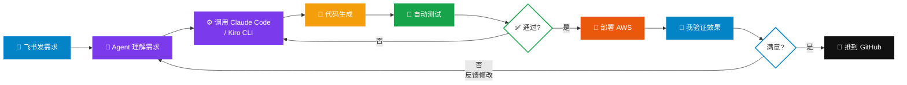

<CoverSlide
  title="Ways of Working"
  subtitle="用 AI Agent 给客户做 AI 编程 Demo 的实战经验"
  tagline="AWS SA Team 内部分享 · 2026.03"
/>

---

# Agenda

<CardGrid :columns="4">
  <AgendaCard number="1" title="背景与目标" description="客户诉求<br/>Demo 策略" />
  <AgendaCard number="2" title="工具栈" description="OpenClaw + Claude Code<br/>+ Kiro CLI" />
  <AgendaCard number="3" title="两次 Demo 实战" description="从准备到交付<br/>全流程复盘" />
  <AgendaCard number="4" title="踩坑与教训" description="可复用的<br/>方法论沉淀" />
</CardGrid>

---
layout: section
---

<SectionDivider
  section="Part One"
  title="背景与目标"
  subtitle="为什么做这件事，客户到底想看什么"
/>

---

# 客户背景

<div style="display: grid; grid-template-columns: 1fr 1fr; gap: 2rem; margin-top: 1.5rem;">

<div>

### Smile Corp

- 正畸行业头部企业
- 研发 + 制造 + 数字化，IT 团队上百人
- 内部系统：Java / Spring / React
- 已有 AI 意识，但**缺乏 AI 编程落地路径**

</div>

<div>

### 客户真正想知道的

- ❓ OpenClaw 和 Claude Code 能做什么？
- ❓ AI 写代码靠谱吗？从需求到部署能参与多少？
- ❓ 怎么跟现有工作流结合？
- ❓ 成本和 ROI 是什么样？

</div>

</div>

<div style="margin-top: 1.5rem; padding: 1rem 1.5rem; background: #f0f9ff; border-left: 4px solid #0284c7; border-radius: 8px; font-size: 0.9rem;">
💡 <strong>受众</strong>：产研团队全员（开发、测试、产品经理、运营等），每次分享 2 小时
</div>

---

# Demo 策略：两次递进式展示

<ProcessChevrons
  :steps="[
    { label: 'Session 1', sublabel: 'OpenClaw', detail: '端到端软件研发', color: '#0284c7' },
    { label: '埋下伏笔', sublabel: '引出深度话题', detail: 'Claude Code 初体验', color: '#6b7280' },
    { label: 'Session 2', sublabel: 'Claude Code', detail: '深度技术分享', color: '#16a34a' }
  ]"
  :details="[
    { borderColor: '#0284c7', items: ['Kiro CLI + Claude Code + OpenClaw', '从需求到部署全流程', '让客户看到 AI 编程全貌'] },
    { borderColor: '#6b7280', items: ['Session 1 中展示 Claude Code 能力', '客户对多 Agent 协作产生兴趣', '自然过渡到深度分享'] },
    { borderColor: '#16a34a', items: ['Agent Teams 多 Agent 并行开发', 'SmileGuard 完整项目实战', '深入 Claude Code 工作方式'] }
  ]"
/>

<div style="margin-top: 1.5rem; padding: 1rem 1.5rem; background: #fef9c3; border-left: 4px solid #f59e0b; border-radius: 8px; font-size: 0.9rem;">
⚡ <strong>准备方式</strong>：全程通过跟 OpenClaw（AI Agent）聊天完成 Demo 设计和实现 — Agent 调用 Claude Code 等工具做具体编码、部署。<br/>
<strong>第一次</strong>：~5-6 小时（跑通 OpenClaw + Claude Code 协作流程）→ <strong>第二次</strong>：~2-3 小时（流程熟练，效率翻倍）
</div>

---
layout: section
---

<SectionDivider
  section="Part Two"
  title="工具栈"
  subtitle="我是怎么用 AI 来准备给客户的 AI 编程 Demo 的"
/>

---

# 核心工具栈

<div style="display: grid; grid-template-columns: repeat(3, 1fr); gap: 1.2rem; margin-top: 1rem;">

<div style="padding: 1.2rem; border: 2px solid #0284c7; border-radius: 12px; text-align: center;">
<div style="font-size: 2rem;">🦞</div>
<div style="font-size: 1rem; font-weight: 700; margin: 0.3rem 0;">OpenClaw</div>
<div style="font-size: 0.75rem; color: #666;">
AI Agent 协调中枢<br/>
飞书/Telegram 多渠道接入<br/>
子 Agent 调度 · Cron 自动化
</div>
</div>

<div style="padding: 1.2rem; border: 2px solid #f59e0b; border-radius: 12px; text-align: center;">
<div style="font-size: 2rem;">🤖</div>
<div style="font-size: 1rem; font-weight: 700; margin: 0.3rem 0;">Claude Code</div>
<div style="font-size: 0.75rem; color: #666;">
代码生成与审查<br/>
Agent Teams 多 Agent 并行<br/>
Superpowers 增强模式
</div>
</div>

<div style="padding: 1.2rem; border: 2px solid #16a34a; border-radius: 12px; text-align: center;">
<div style="font-size: 2rem;">⚡</div>
<div style="font-size: 1rem; font-weight: 700; margin: 0.3rem 0;">Kiro CLI</div>
<div style="font-size: 0.75rem; color: #666;">
结构化开发流程<br/>
Spec Kit → Plan → Tasks<br/>
非交互式 CLI 模式
</div>
</div>

</div>

<div style="display: grid; grid-template-columns: repeat(4, 1fr); gap: 1rem; margin-top: 1rem;">

<div style="padding: 0.8rem; border: 1px solid #e5e7eb; border-radius: 8px; text-align: center;">
<div style="font-size: 1.2rem;">🐙</div>
<div style="font-size: 0.85rem; font-weight: 600;">GitHub</div>
<div style="font-size: 0.7rem; color: #888;">代码托管 · CI/CD<br/>GitHub Actions · Pages</div>
</div>

<div style="padding: 0.8rem; border: 1px solid #e5e7eb; border-radius: 8px; text-align: center;">
<div style="font-size: 1.2rem;">🎭</div>
<div style="font-size: 0.85rem; font-weight: 600;">Playwright</div>
<div style="font-size: 0.7rem; color: #888;">浏览器自动化<br/>E2E 测试 · 截图验证</div>
</div>

<div style="padding: 0.8rem; border: 1px solid #e5e7eb; border-radius: 8px; text-align: center;">
<div style="font-size: 1.2rem;">🔊</div>
<div style="font-size: 0.85rem; font-weight: 600;">TTS / ElevenLabs</div>
<div style="font-size: 0.7rem; color: #888;">AI 语音生成<br/>介绍视频旁白</div>
</div>

<div style="padding: 0.8rem; border: 1px solid #e5e7eb; border-radius: 8px; text-align: center;">
<div style="font-size: 1.2rem;">📊</div>
<div style="font-size: 0.85rem; font-weight: 600;">Slidev</div>
<div style="font-size: 0.7rem; color: #888;">Markdown → PPT<br/>Vue 组件 · GitHub Pages</div>
</div>

</div>

<div style="margin-top: 1rem; padding: 0.8rem 1.2rem; background: #fef9c3; border-left: 4px solid #f59e0b; border-radius: 8px; font-size: 0.8rem;">
🎬 <strong>彩蛋</strong>：OpenClaw 的介绍视频也是通过跟另一个 OpenClaw 实例（Matrix）聊天生成的 — 写脚本 + TTS 配音，前后 ~15 分钟
</div>

---

# Ways of Working：人 + Agent 协同

<div style="display: grid; grid-template-columns: 1fr 1fr; gap: 2rem; margin-top: 1rem;">

<div>

### 我（SA）的角色
- 🎯 定义 Demo 场景和故事线
- 📝 撰写需求文档和 Prompt
- ✅ 验证产出物质量
- 🎤 现场演示和讲解

</div>

<div>

### Agent 的角色
- 🔧 代码生成、审查、重构
- 📊 架构图、文档自动生成
- 🚀 CDK 部署到 AWS
- 🧪 自动化测试（E2E）

</div>

</div>



<div style="margin-top: 0.5rem; text-align: center; font-size: 0.85rem; color: #666;">
💬 全程通过<strong>飞书消息</strong>与 Agent 交互，不需要 SSH 到服务器手动操作
</div>

---
layout: section
---

<SectionDivider
  section="Part Three"
  title="Demo 1：全流程三场景"
  subtitle="3月19日 — 从需求到部署，1 小时跑完"
/>

---

# Demo 1 概览

<DataTable
  :columns="[
    { key: 'scenario', label: '场景', width: '15%' },
    { key: 'theme', label: '主题' },
    { key: 'tool', label: '工具', width: '22%' },
    { key: 'output', label: '产出物' },
    { key: 'time', label: '用时', width: '10%', align: 'center' }
  ]"
  :rows="[
    { scenario: '场景一', theme: '患者病例追踪看板（前端）', tool: 'Spec Kit + Kiro CLI', output: 'React SPA + 模拟数据', time: '~15min' },
    { scenario: '场景二', theme: '矫治方案审批微服务（全栈）', tool: 'AI-DLC + Claude Code', output: '6 个微服务包 + 67 源文件', time: '~25min' },
    { scenario: '场景三', theme: '微服务部署到 AWS', tool: 'OpenClaw + CDK', output: 'ECS Fargate + Aurora + ALB', time: '~15min' }
  ]"
  caption="统一主题：智能正畸病例管理平台"
/>

<div style="margin-top: 1.5rem;">

**故事线**：三个场景**递进串联** — 前端 → 后端全栈 → 云部署，展示 AI 参与完整软件生命周期

</div>

---

# 场景一：Spec Kit 需求驱动开发

<div style="display: grid; grid-template-columns: 1fr 1fr; gap: 2rem; margin-top: 1rem;">

<div>

### 流程

<ProcessChevrons
  :steps="[
    { label: '需求文档', color: '#6366f1' },
    { label: 'Spec', color: '#8b5cf6' },
    { label: 'Plan', color: '#a78bfa' },
    { label: '17 Tasks', color: '#c4b5fd' },
    { label: '代码生成', color: '#16a34a' }
  ]"
/>

- Kiro Spec Kit 将模糊需求 → 结构化规格
- 自动拆解为 17 个可执行任务
- Kiro CLI 逐个完成代码生成

</div>

<div>

### 产出物

- ✅ React 单页应用
- ✅ 患者列表 + 状态筛选
- ✅ 模拟数据 + 图表展示
- ✅ 完整可运行的前端看板

### 客户反馈

> "从需求到可运行的前端，比我们团队手写快 5-10 倍"

</div>

</div>

---

# 场景二：AI-DLC 全栈微服务

<div style="display: grid; grid-template-columns: 1fr 1fr; gap: 2rem; margin-top: 1rem;">

<div>

### AI-DLC 是什么？

**A**I-**D**riven **L**ifecycle **C**onstruction

用 Claude Code 从架构设计到编码全自动：

1. 📋 需求分析 → 用户故事
2. 🏗️ 架构设计 → 微服务拆分
3. 💻 代码生成 → 6 个服务包
4. 🐳 容器化 → Docker Compose
5. ✅ 集成测试 → 全功能验证

</div>

<div>

### 产出物

| 指标 | 数量 |
|------|------|
| 微服务包 | 6 个 |
| 源文件 | 67 个 |
| API 端点 | 12+ 个 |
| 完整功能 | 登录/创建/审核/审批/通知 |

### 踩过的坑

- 中文用户名在 HTTP Header 需要编码
- Docker 网络内前端代理 URL 不同
- Rate limit 需要调高（Demo 场景）

</div>

</div>

---

# 场景三：CDK 一键部署到 AWS

<div style="display: grid; grid-template-columns: 1fr 1fr; gap: 2rem; margin-top: 1rem;">

<div>

### 架构

```
Client → SSM Port Forward → EC2
  → socat → Internal ALB
  → ECS Fargate (ARM64)
  → Aurora PostgreSQL v2
```

- 让 Agent 写 CDK Stack + 部署脚本
- **Internal ALB** 避免安全扫描删端口
- VPC Peering 连通 EC2 和 CDK VPC

</div>

<div>

### 现场效果

- 🟢 登录页面 ✅
- 🟢 创建方案（多角色） ✅
- 🟢 审核/驳回/审批 ✅
- 🟢 通知铃铛（未读消息） ✅
- 🟢 Dashboard 统计 ✅
- 🟢 状态筛选 ✅

**11 项功能测试全部通过**

### 踩的坑

- Aurora PG 15.4 不可用 → 16.6
- Docker ARM64 镜像 + x86 Fargate = 💥
- 安全扫描删 ALB Listener → Internal ALB

</div>

</div>

---
layout: section
---

<SectionDivider
  section="Part Three (cont.)"
  title="Demo 2：多 Agent + 深度场景"
  subtitle="3月25-26日 — SmileGuard 矫治风险预警仪表盘"
/>

---

# SmileGuard：为什么做第二次 Demo

<div style="display: grid; grid-template-columns: 1fr 1fr; gap: 2rem; margin-top: 1.5rem;">

<div>

### Demo 1 的局限

- 单人开发模式，客户说："**我们团队有多个开发**"
- 前后端独立，没展示**并行协作**
- CDK 部署偏运维视角，开发体感不足

</div>

<div>

### Demo 2 目标

- 🎯 展示 **Agent Teams**：3 个 Agent 并行开发
- 🎯 展示 **Superpowers**：增强版开发流程
- 🎯 展示 **Playwright**：AI 驱动 E2E 测试
- 🎯 贴近真实业务：正畸风险预警

</div>

</div>

<div style="margin-top: 1.5rem; padding: 1rem 1.5rem; background: #f0fdf4; border-left: 4px solid #16a34a; border-radius: 8px; font-size: 0.9rem;">
💡 <strong>关键决策</strong>：从"AI 能写代码"升级到"AI 能像一个开发团队一样协作"
</div>

---

# SmileGuard 技术架构

<div style="display: grid; grid-template-columns: 1fr 1fr; gap: 2rem; margin-top: 1rem;">

<div>

### 后端：Agent Teams 并行开发

```
Lead Agent（协调）
  ├─ data-engineer    → smile-data 模块
  ├─ risk-engine      → smile-engine 模块
  └─ api-developer    → smile-api 模块
```

- Spring Boot 3.5 + Java 17 + Maven 多模块
- 模块间通过 `smile-common` 共享模型
- **关键**：每个 Agent 只碰自己的模块目录

</div>

<div>

### 前端：Superpowers + Playwright

```
Superpowers 驱动：
  brainstorm → plan → TDD → review
Playwright 验证：
  浏览器 E2E 自动化测试
```

- React + TypeScript + Tailwind + Recharts
- 风险仪表盘：风险评分、趋势图、患者列表
- AI 自动写测试并运行验证

</div>

</div>

---

# Agent Teams 最佳实践（精华）

<div style="display: grid; grid-template-columns: 1fr 1fr; gap: 1rem; margin-top: 1rem;">

<div style="display: flex; gap: 1rem; padding: 0.8rem 1.2rem; border: 1px solid #e5e7eb; border-radius: 10px;">
<div style="font-size: 1.6rem; font-weight: 700; color: #0284c7; min-width: 36px;">1</div>
<div>
<div style="font-size: 1rem; font-weight: 600;">3 个 Agent 是甜区</div>
<div style="font-size: 0.72rem; color: #888; margin-top: 0.2rem;">太少失去并行优势，太多协调成本飙升</div>
</div>
</div>

<div style="display: flex; gap: 1rem; padding: 0.8rem 1.2rem; border: 1px solid #e5e7eb; border-radius: 10px;">
<div style="font-size: 1.6rem; font-weight: 700; color: #16a34a; min-width: 36px;">2</div>
<div>
<div style="font-size: 1rem; font-weight: 600;">绝对不让 Agent 碰同一个文件</div>
<div style="font-size: 0.72rem; color: #888; margin-top: 0.2rem;">Maven 多模块天然隔离，先拆分再上 Teams</div>
</div>
</div>

<div style="display: flex; gap: 1rem; padding: 0.8rem 1.2rem; border: 1px solid #e5e7eb; border-radius: 10px;">
<div style="font-size: 1.6rem; font-weight: 700; color: #f59e0b; min-width: 36px;">3</div>
<div>
<div style="font-size: 1rem; font-weight: 600;">CLAUDE.md 是团队共享大脑</div>
<div style="font-size: 0.72rem; color: #888; margin-top: 0.2rem;">共享模型、命名规范、接口契约全在里面</div>
</div>
</div>

<div style="display: flex; gap: 1rem; padding: 0.8rem 1.2rem; border: 1px solid #e5e7eb; border-radius: 10px;">
<div style="font-size: 1.6rem; font-weight: 700; color: #ef4444; min-width: 36px;">4</div>
<div>
<div style="font-size: 1rem; font-weight: 600;">Lead Agent 会偷偷自己干活</div>
<div style="font-size: 0.72rem; color: #888; margin-top: 0.2rem;">用 tmux split pane 盯着，别让它跳过分工</div>
</div>
</div>

</div>

<div style="margin-top: 1.5rem; font-size: 0.85rem; color: #666;">
🎬 Demo 展示模式：tmux split pane，3 个终端同时跑，现场看 3 个 Agent 实时写代码
</div>

---
layout: section
---

<SectionDivider
  section="Part Four"
  title="踩坑与教训"
  subtitle="那些花了真金白银买来的经验"
/>

---

# 💸 成本实况

<StatHighlight
  :stats="[
    { value: '$0.32', label: '每次 PR 安全扫描', color: '#16a34a' },
    { value: '$20.74', label: 'Superpowers 调试烧掉的', color: '#ef4444' },
    { value: '~$5', label: 'Demo 1 全流程', color: '#0284c7' },
    { value: '3 个', label: '被限流的 AWS 账号', color: '#f59e0b' }
  ]"
/>

<div style="margin-top: 2rem;">

### Bedrock 限流是 Demo 最大的不确定性

- Opus 4.6 输出速度在 Bedrock 上比直连慢 2-3x
- **一个 AWS 账号不够用** — Demo 前准备 2-3 个备用
- Superpowers writing-plans + Opus = 💥（40K-50K token 输出卡死）
- `ANTHROPIC_MODEL` 环境变量会覆盖 settings.json，容易踩坑

</div>

---

# 关键教训（适用于所有 SA）

<div style="display: grid; grid-template-columns: 1fr 1fr; gap: 1rem; margin-top: 1rem;">

<div style="display: flex; gap: 1rem; padding: 0.8rem 1.2rem; border: 1px solid #e5e7eb; border-radius: 10px;">
<div style="font-size: 1.6rem; font-weight: 700; color: #0284c7; min-width: 36px;">1</div>
<div>
<div style="font-size: 1rem; font-weight: 600;">先读官方文档再动手</div>
<div style="font-size: 0.72rem; color: #888; margin-top: 0.2rem;">docs/solutions.md 有完整范例，早看到能省 1 小时</div>
</div>
</div>

<div style="display: flex; gap: 1rem; padding: 0.8rem 1.2rem; border: 1px solid #e5e7eb; border-radius: 10px;">
<div style="font-size: 1.6rem; font-weight: 700; color: #16a34a; min-width: 36px;">2</div>
<div>
<div style="font-size: 1rem; font-weight: 600;">先本地验证再上云</div>
<div style="font-size: 0.72rem; color: #888; margin-top: 0.2rem;">别每次改一行代码就重新部署等 6 分钟</div>
</div>
</div>

<div style="display: flex; gap: 1rem; padding: 0.8rem 1.2rem; border: 1px solid #e5e7eb; border-radius: 10px;">
<div style="font-size: 1.6rem; font-weight: 700; color: #f59e0b; min-width: 36px;">3</div>
<div>
<div style="font-size: 1rem; font-weight: 600;">连续失败 2 次就停下来读源码</div>
<div style="font-size: 0.72rem; color: #888; margin-top: 0.2rem;">盲试参数不如理解机制，读源码比猜快 10 倍</div>
</div>
</div>

<div style="display: flex; gap: 1rem; padding: 0.8rem 1.2rem; border: 1px solid #e5e7eb; border-radius: 10px;">
<div style="font-size: 1.6rem; font-weight: 700; color: #ef4444; min-width: 36px;">4</div>
<div>
<div style="font-size: 1rem; font-weight: 600;">客户数据绝对不推 GitHub</div>
<div style="font-size: 0.72rem; color: #888; margin-top: 0.2rem;">犯过一次，紧急 filter-repo 修复。这是红线</div>
</div>
</div>

</div>

---

# 可复用的方法论

<TChart
  leftTitle="❌ 不要这样做"
  rightTitle="✅ 应该这样做"
  leftColor="#ef4444"
  rightColor="#16a34a"
  :leftItems="[
    { text: '直接上手写代码，边做边查' },
    { text: '每次改一行就部署到云上等' },
    { text: '一次改三个变量同时调试' },
    { text: '用 subagent 替代客户指定的工具' },
    { text: '不确定时说「应该没问题了」' }
  ]"
  :rightItems="[
    { text: '先找官方文档 + examples/' },
    { text: '先本地验证，通过后再部署' },
    { text: '一次只改一个变量，验证后再改下一个' },
    { text: '用客户要求的工具（Kiro 就用 Kiro）' },
    { text: '诚实报告不确定性：「试一下看看」' }
  ]"
/>

---

# 整体时间线回顾

<SwimLaneTimeline
  :periods="['3/19', '3/20-22', '3/23', '3/24', '3/25', '3/26']"
  :lanes="[
    { label: 'Demo 准备', color: '#0284c7', segments: [
      { span: 1, label: 'Demo 1 三场景', shade: 'dark' },
      { span: 2, label: '客户反馈收集', shade: 'light' },
      { span: 1, label: 'POC 调研', shade: 'medium' },
      { span: 1, label: '6 Cases 跑完', shade: 'dark' },
      { span: 1, label: 'SmileGuard', shade: 'dark' }
    ]},
    { label: '工具调试', color: '#f59e0b', segments: [
      { span: 1, label: 'CDK 部署', shade: 'medium' },
      { span: 1, label: '', shade: 'light' },
      { span: 1, label: 'CI 安全扫描', shade: 'dark' },
      { span: 1, label: 'Whisper 部署', shade: 'medium' },
      { span: 1, label: 'Kiro CLI', shade: 'medium' },
      { span: 1, label: 'Agent Teams', shade: 'dark' }
    ]},
    { label: '踩坑修复', color: '#ef4444', segments: [
      { span: 1, label: 'ARM64/ALB', shade: 'medium' },
      { span: 1, label: '', shade: 'light' },
      { span: 1, label: 'MCP/权限', shade: 'dark' },
      { span: 1, label: 'transformers', shade: 'medium' },
      { span: 1, label: '数据泄露修复', shade: 'dark' },
      { span: 1, label: 'Superpowers', shade: 'dark' }
    ]}
  ]"
  :milestones="[
    { text: 'Demo 1 交付' },
    { text: 'Demo 2 交付' }
  ]"
/>

---

# 给 SA 同事的建议

<div style="display: grid; grid-template-columns: 1fr 1fr; gap: 2rem; margin-top: 1.5rem;">

<div>

### 🎯 Demo 准备清单

- ☐ Bedrock 账号配额确认（Opus/Sonnet）
- ☐ 准备 2-3 个备用 AWS 账号
- ☐ 提前跑一遍完整 Demo flow
- ☐ GitHub repo 确认无客户敏感数据
- ☐ 网络环境测试（VPN/代理可能影响 API）
- ☐ 准备离线 fallback 方案

</div>

<div>

### 🛠️ 工具链推荐

| 场景 | 推荐工具 |
|------|----------|
| 快速前端原型 | Kiro Spec Kit |
| 全栈微服务 | Claude Code (AI-DLC) |
| 多人并行开发 | Agent Teams |
| CI 代码审查 | Claude Code Action |
| 结构化 POC | Kiro CLI + 自定义 Prompt |
| 部署到 AWS | CDK + OpenClaw Agent |

</div>

</div>

---

# 资源链接

<div style="display: grid; grid-template-columns: 1fr 1fr; gap: 2rem; margin-top: 1.5rem;">

<div>

### Demo 1 资源
- 📦 [openclaw-ai-programming-demo](https://github.com/w0yne/openclaw-ai-programming-demo)
- 🗺️ [架构图 (GitHub Pages)](https://github.com/w0yne/openclaw-ai-programming-demo-architecture)

### Demo 2 资源
- 📦 [smile-demo-project](https://github.com/w0yne/smile-demo-project)

</div>

<div>

### 工具文档
- 🔗 [OpenClaw Docs](https://docs.openclaw.ai)
- 🔗 [Claude Code Action](https://github.com/anthropics/claude-code-action)
- 🔗 [Kiro CLI](https://kiro.dev/docs/cli/)
- 🔗 [Agent Teams](https://code.claude.com/docs/agent-teams)

### Slides 模板
- 📊 [consulting-slides-demo](https://github.com/w0yne/consulting-slides-demo)

</div>

</div>

---

<CoverSlide
  variant="thank-you"
  title="谢谢"
  subtitle="Questions & Discussion"
/>
